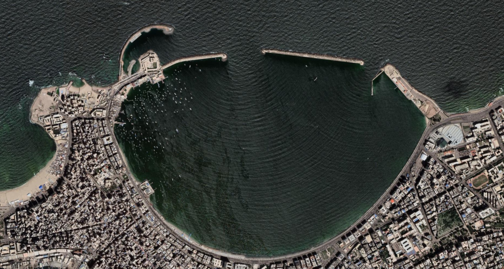

# Oh Bemn! Ocean Surface Wave Boundary Element Method

<!-- [](https://crates.io/crates/ohbemn) -->
<!-- [](https://docs.rs/ohbemn/) -->
[](https://pypi.org/project/ohbemn/)
[](https://github.com/gauteh/ohbemn/actions)
[](https://github.com/gauteh/ohbemn/actions)

`ohbemn` is an implementation of the Boundary Element Method based on [Kikup
(1998)](https://www.researchgate.net/profile/Stephen-Kirkup/publication/261760562_The_Boundary_Element_Method_in_Acoustics/links/59e730b44585151e5465c4a7/The-Boundary-Element-Method-in-Acoustics.pdf) designed for simple simulations of ocean surface waves.

<table>
   <tr>
      <td>
         
      </td>
      <td>
         <video controls>
            <source src="./examples/east-alexandria/ea-T8.0s_R0.1.mp4" type="video/mp4">
         </video>
      </td>
   </tr>
</table>

## Installation

1. Install dependencies: `gfortran=13` and `rust`. Can also be installed via conda/mamba after
   you have set up and activated the environment below (it may be necessary to
   symlinking `f95` to conda `gfortran` to make sure `gcc` and `gfortran` match).

2. Set up and activate the conda/mamba environment:

```sh
$ mamba env create -f environment.yml
$ conda activate ohbemn
```

3. Build and install this package into the conda/mamba environment:

```sh
$ pip install -e .
```

## Inspiration

* https://www.boundary-element-method.com/
* https://www.boundary-element-method.com/helmholtz/index.htm
* https://github.com/fjargsto/abem
* https://github.com/lzhw1991/AcousticBEM
* https://wikiwaves.org/Boundary_Element_Method_for_a_Fixed_Body_in_Finite_Depth
